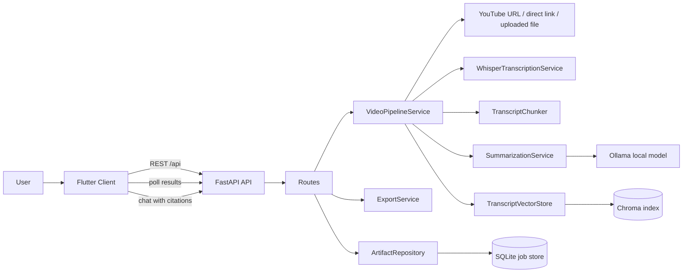
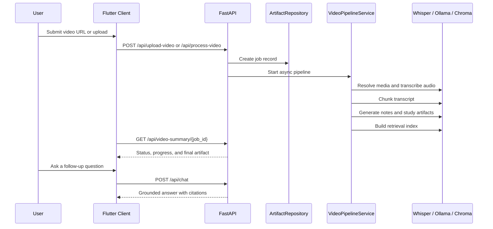

# Video Note Extractor

Video Note Extractor is a local-first AI application that turns long-form videos into structured notes, chapter timelines, study guides, and grounded chat answers. The backend is built with FastAPI and a modular analysis pipeline, while the client is a Flutter app that runs on web and mobile.

## What It Produces

- Transcript-aware quick summaries and five-minute recaps
- Timestamped chapters, note sections, and navigation anchors
- Action items, key quotes, glossary terms, and study questions
- Grounded chat answers with transcript citations
- Exportable notes in Markdown, PDF, and Notion-friendly formats
- A demo mode for UI and pipeline development without live local AI services

## Tech Stack

- `FastAPI` for the API layer and background job orchestration
- `Flutter` for the cross-platform client
- `Whisper` for transcription
- `Ollama` for local LLM-backed summarization and chat
- `Chroma` for transcript retrieval indexing
- `sentence-transformers` for embeddings
- `SQLite` for job persistence and artifact storage
- `yt-dlp` and `ffmpeg` for media ingestion and preprocessing

## System Architecture



The backend is designed to degrade gracefully:

- With `DEMO_MODE=true`, it returns rich sample outputs for UI and workflow testing.
- With `DEMO_MODE=false` but no local LLM available, heuristic summarization still produces useful artifacts.
- With Ollama and embeddings enabled, the full local AI path powers summaries, study assets, and retrieval-backed chat.

## Processing Flow



## Repository Layout

| Path | Purpose |
| --- | --- |
| `backend/` | FastAPI app, processing pipeline, storage, summarization, retrieval, and tests |
| `frontend_flutter/` | Flutter UI for upload, processing, results, and chat |
| `docs/` | Architecture and implementation notes |
| `docker-compose.yml` | Local container orchestration for backend and frontend |

## Backend Architecture

| Module | Key Files | Responsibility |
| --- | --- | --- |
| API routes | `backend/app/routes/videos.py`, `backend/app/routes/chat.py` | Exposes upload, processing, summary, study-guide, export, media, and chat endpoints |
| Pipeline orchestration | `backend/app/services/pipeline.py` | Coordinates job lifecycle, progress tracking, transcription, chunking, summarization, and indexing |
| Persistence | `backend/app/services/repository.py`, `backend/app/storage/database.py` | Stores jobs and serialized artifacts in SQLite and manages uploads/media resolution |
| Transcription | `backend/app/transcription/whisper_service.py` | Generates transcript text, segments, and word-level timing |
| Summarization | `backend/app/summarization/summarizer.py` | Produces summaries, chapters, glossary, study questions, mind map, and fallback heuristics |
| Retrieval | `backend/app/rag/vector_store.py` | Indexes transcript chunks in Chroma and serves grounded chat answers |
| Shared models | `backend/app/models/domain.py`, `backend/app/schemas/video.py` | Defines artifact shapes, pipeline state, and API contracts |
| Text intelligence | `backend/app/utils/text_intelligence.py` | Handles keyword extraction, sentence splitting, topic cleanup, scoring, and other heuristics |

## Output Artifact Shape

Each processed job can contain:

- `quick_summary`
- `five_minute_summary`
- `key_topics`
- `note_sections`
- `timestamps`
- `chapters`
- `action_items`
- `key_quotes`
- `learning_objectives`
- `glossary`
- `study_questions`
- `analysis_metrics`
- `mind_map`
- `chat_history`

This makes the project useful for lectures, podcasts, tutorials, team recordings, and research videos where users want both skim-friendly notes and deeper retrieval.

## API Surface

| Method | Endpoint | Purpose |
| --- | --- | --- |
| `POST` | `/api/upload-video` | Save a local video for later processing |
| `POST` | `/api/process-video` | Start a job from an upload, YouTube URL, or direct source URL |
| `GET` | `/api/video-summary/{job_id}` | Fetch the full job artifact and status |
| `GET` | `/api/timestamps/{job_id}` | Retrieve timeline items |
| `GET` | `/api/chapters/{job_id}` | Retrieve generated chapters |
| `GET` | `/api/action-items/{job_id}` | Retrieve generated action items |
| `GET` | `/api/study-guide/{job_id}` | Retrieve learning objectives, glossary, questions, and metrics |
| `POST` | `/api/chat` | Ask grounded questions against a processed transcript |
| `GET` | `/api/export/{job_id}?format=markdown|pdf|notion` | Export notes |
| `GET` | `/api/media/{job_id}` | Stream the resolved media file when available |
| `GET` | `/health` | Service health and model configuration summary |

## Quick Start

### 1. Backend

```bash
cd backend
python3 -m venv .venv
source .venv/bin/activate
pip install -r requirements.txt
cp .env.example .env
uvicorn app.main:app --reload
```

API base URL:

- `http://localhost:8000`
- Swagger UI: `http://localhost:8000/docs`

### 2. Optional local AI services

For the fully local AI path, start Ollama and pull a model:

```bash
ollama serve
ollama pull llama3
```

Make sure `ffmpeg` and `yt-dlp` are also available in the backend environment.

### 3. Flutter frontend

```bash
cd frontend_flutter
flutter pub get
flutter run -d chrome
```

If the backend is not running on localhost, provide a custom base URL:

```bash
flutter run -d chrome --dart-define=API_BASE_URL=http://YOUR_HOST:8000/api
```

## Configuration

The backend reads environment variables from `backend/.env`. The most important settings are:

| Variable | Purpose |
| --- | --- |
| `DEMO_MODE` | Enables sample output mode without live media or AI calls |
| `OLLAMA_BASE_URL` | Base URL for the local Ollama runtime |
| `OLLAMA_MODEL` | Model name used for summarization and grounded chat |
| `DATABASE_PATH` | SQLite database location |
| `CHROMA_PERSIST_DIR` | Directory for vector index persistence |
| `WHISPER_MODEL_SIZE` | Whisper model size for transcription |
| `EMBEDDING_MODEL` | Sentence-transformer model used for retrieval |
| `BACKGROUND_INDEXING` | Enables asynchronous index building after artifact completion |

See `backend/.env.example` for the full configuration list.

## Docker

```bash
docker compose up --build
```

Services:

- Backend: `http://localhost:8000`
- Frontend web: `http://localhost:8080`

To include the local AI runtime profile:

```bash
docker compose --profile local-ai up --build
```

## Development Notes

- Example request payload: `backend/data/samples/example_request.json`
- Architecture notes: `docs/system_architecture.md`
- Backend model guide: `docs/backend_models_guide.md`
- Tests: `backend/tests/`

## Why The Backend Design Works Well

- The pipeline is modular, so transcription, summarization, and retrieval can evolve independently.
- Artifacts are persisted as structured data, which keeps the frontend simple and makes exports straightforward.
- Retrieval uses transcript chunks plus citations, so answers stay grounded instead of drifting into generic summaries.
- The fallback path keeps the product useful even when full local AI services are not available.
